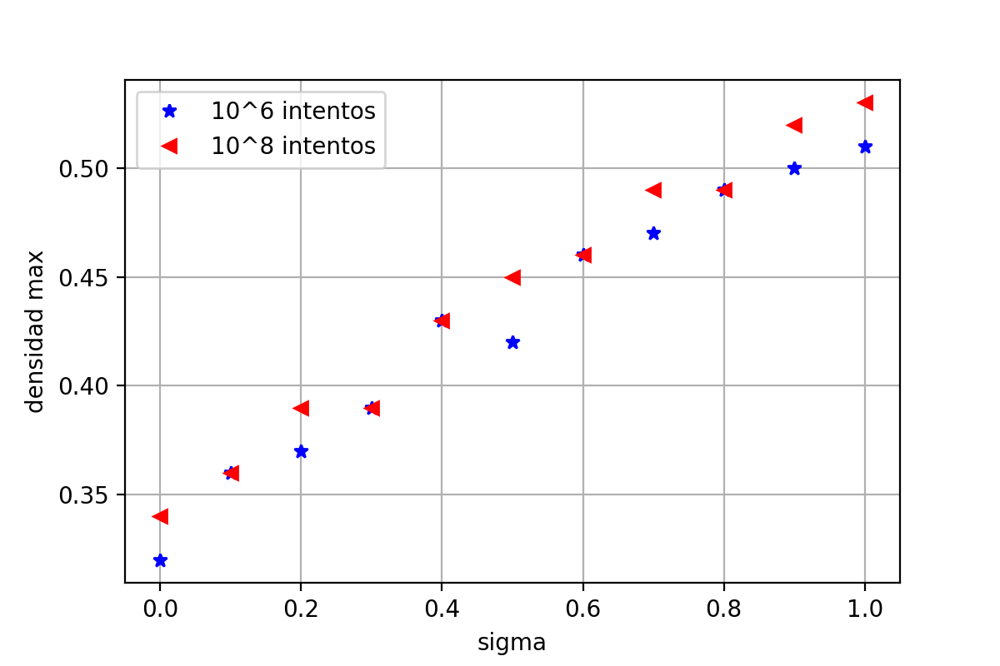

# macfe

Densidad máxima alcanzada para la distribución:

Tengo que hacer más pruebas, pero parece bastante representativo.

Campos remanentes en función del sigma

sigma 0

sigma 0.05

sigma 0.1

sigma 0.25

sigma 0.5

sigma 0.75

sigma 1

Campos coercitivos en función del sigma

sigma 0

sigma 0.05

